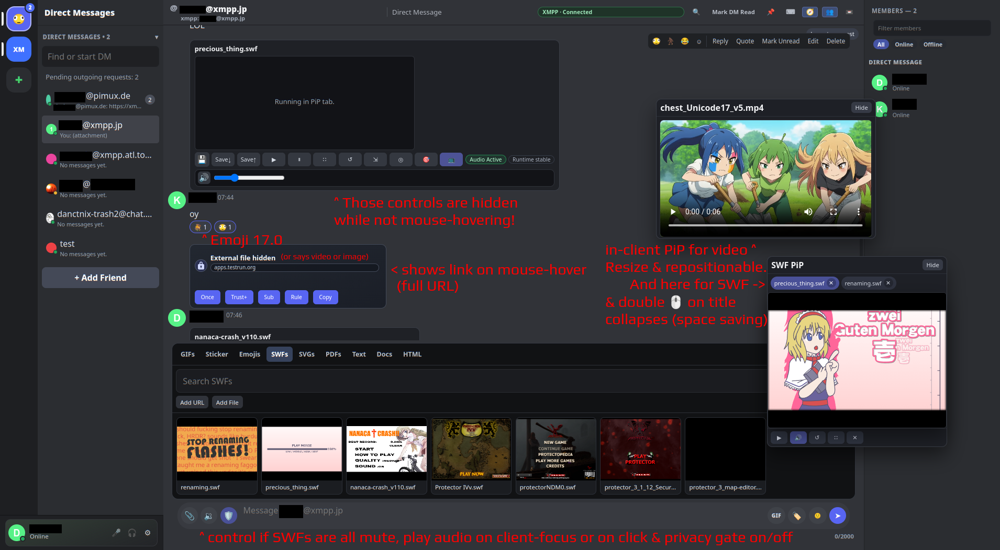

# shitcord67 (Discord-lookalike MVP)

A lightweight Discord-style chat client prototype with local persistence.

XMPP protocol coverage is tracked in `SUPPORTED_XEPS.md`.

## Run (Recommended: Desktop Electron)
1. Install dependencies once:
   - `npm install`
2. Start desktop client:
   - `npm run electron`
   - launches Electron and starts/stops local stack automatically.
3. Optional gateway modes:
   - `npm run electron:with-gateway`
   - `npm run electron:no-gateway`

## Run (Linux Web)
1. Install dependencies once:
   - `npm install`
2. Start client + optional XMPP auth gateway with lifecycle cleanup:
   - `npm run dev:stack`
   - runs `scripts/run-client-stack.sh`
   - starts client at `http://127.0.0.1:8080`
   - in `auto` mode, starts gateway at `http://127.0.0.1:8790` when `.xmpp.local.json` exists (auth/discovery + media compatibility proxy)
   - child processes started by the script are terminated on `Ctrl+C`/`TERM`/script exit
3. Override gateway mode when needed:
   - `npm run dev:stack -- --with-gateway`
   - `npm run dev:stack -- --no-gateway`
4. Direct script usage (same behavior):
   - `scripts/run-client-stack.sh --help`

## Desktop Env Overrides
1. Optional env overrides:
   - `CLIENT_HOST`, `CLIENT_PORT`, `GATEWAY_HOST`, `GATEWAY_PORT`, `ELECTRON_GATEWAY_MODE`, `ELECTRON_START_TIMEOUT_MS`

## Implemented
- Login by username (creates/switches local accounts).
- XMPP login now shows a friendly progress card with current step + elapsed timer during server/auth checks.
- Bottom-left account dock with avatar, display name, status, and settings gear.
- Full-screen user settings page (Discord-style categories: My Account, Profiles, Appearance, Advanced).
- Create guilds and channels.
- Guild creation now supports template presets (friends/gaming/community/study/blank) with optional starter channels.
- Guild settings dialog supports rename, description, accent color, and admin-gated delete flow.
- Channel topics with inline edit control in chat header.
- Send messages as current user.
- Message actions: reply, edit, delete.
- Edited-message indicator (`(edited)`).
- Slash commands with live autocomplete popup (`/help`, `/me`, `/shrug`, `/note`, `/topic`, `/slowmode`, `/rename`, `/channelinfo`, `/whereami`, `/jumpunread`, `/nextunread`, `/prevunread`, `/unreadcount`, `/pins`, `/unpinall`, `/clear`, `/nick`, `/status`, `/markread`, `/mediaprivacy`, `/trustdomain`, `/untrustdomain`, `/tableflip`, `/unflip`, `/lenny`, `/roll`, `/timestamp`).
- Added `/presence <online|idle|dnd|invisible>` to change online presence quickly.
- Self profile popout now includes a presence selector (Online/Idle/DND/Invisible) and publishes presence updates to XMPP when connected.
- Send-later workflow: `/schedule <when> | <text>`, `/scheduled`, `/unschedule <id|last|all>` (channels and DMs).
- `@mention` autocomplete popup with keyboard and mouse selection.
- Lightweight emoji reactions on messages.
- Inline image URL preview for common image links.
- Pin/unpin messages per channel, with a pinned-messages panel.
- Pinned-messages panel now supports live filter and sort modes (newest/oldest/author).
- Guild rail now scrolls as one native-feeling column (brand, guild icons, and `+` create button).
- Unread + mention badges for channels and guilds, with per-account read tracking.
- Quick channel filter input in the sidebar.
- Discord-like media picker panel in the composer (tabs: GIFs, Stickers, Emojis, SWFs, SVGs, PDFs, Text, Docs, HTML).
- GIF picker can load additional remote results on demand ("Load more GIFs").
- Click-to-send media attachments from picker (GIF/sticker/SVG/SWF), including local SWF index support via `swf-index.json`.
- Video attachments render inline with native controls and open-in-tab fallback.
- GIF media sent as MP4/WebM now autoplay + loop inline (no video control chrome).
- Sticker picker supports image stickers plus `.apng` and `.lottie` resources.
- Ruffle and dotLottie runtimes are auto-loaded by the app (no manual user install flow).
- Media runtime bootstrap now tries local bundled paths first and then multiple CDN fallbacks for higher load reliability.
- Guild-scoped custom emoji (image-based) and custom sticker/media resources can be added from URL or local file.
- Debug Console in Advanced settings (runtime status + recent media/ruffle logs).
- Message context menu can copy payload as JSON or Matrix-style XML.
- Message context menu copy actions now include author/timestamp/attachment URL helpers.
- Message context menu includes edit-history actions (`View Edit History`, copy history JSON).
- Message context menu shows SWF actions only when that message has SWF attachments.
- SWF message actions are grouped under a dedicated `SWF` submenu (open viewer/fullscreen/reset/save/copy URL/download).
- SWFs auto-start in chat muted and are paused/resumed based on viewport visibility.
- SWF controls include `Play`, `Pause`, `FullScreen`, `Reset` (with confirmation), `Resize`, and `Optimal Size`.
- Per-SWF audio controls are shown on the left side of each SWF player (speaker toggle + vertical volume slider).
- SWF cards include a top-right `💾` save icon in the filename row for quick save-to-shelf.
- SWF cards show a live audio status badge (`Audio Active`, `Suppressed`, `Muted`), and right-clicking the speaker pins audio to skip auto-mute.
- Advanced settings include SWF audio policy options: single-audio or multi-audio, with global or per-guild focus scope.
- SWF audio focus prefers the SWF nearest the center of the viewport, with fullscreen SWFs prioritized.
- Advanced SWF options include default autoplay/paused mode, pause-on-auto-mute behavior, and optional collapsible VU details.
- SWF top controls are in the header row (save, play/pause, fullscreen, reset, resize, optimal size, solo focus, PiP).
- Tabbed SWF PiP dock lets you keep selected SWFs open while switching guilds/channels.
- SWF PiP now parks/reattaches live runtimes instead of destroying them when the original chat host is gone.
- SWF picker now supports muted Ruffle previews with lightweight sampled frame playback.
- SWF link opens are configured with confirmation prompts (`openUrlMode: "confirm"`).
- Advanced settings now include dedicated `Export SWF Saves` / `Import SWF Saves` (browser local-storage based).
- SVG attachments in chat include a direct `Download SVG` action.
- PDF links/attachments render inline using a custom canvas-based viewer (page + zoom controls) with open/download fallback links.
- Media picker includes dedicated `PDFs`, `Text`, and `Docs` tabs for guild-scoped resources (URL or local file import).
- Composer uses `📎` + sound controls on the left, with GIF/Sticker/Emoji quick buttons on the right.
- Right-click `📎` jumps to the PDF picker tab.
- Composer message limit is configurable (default 2000); click the char counter for temporary extension and double-click to set default.
- Drag and drop or clipboard paste of supported files (`.pdf`, text, OpenDocument, RTF, `.bin`) attaches them to composer; press `Enter` to send.
- Audio links/attachments render with native playback controls.
- Plain-text/code links (`.txt/.md/.json/.js/.css/...`) render inline preview snippets.
- RTF attachments render as inline plain-text previews.
- OpenDocument/Office attachments render in an inline frame with open/download fallback links.
- Binary (`.bin`) attachments render a compact HEX preview in chat.
- PDF viewer controls now auto-hide until hover/focus (touch devices keep controls visible).
- Keyboard shortcuts: `Ctrl+Shift+G/S/E` open GIF/Sticker/Emoji tabs, `Alt+O` opens PDF tab, `Alt+U` opens file attach.
- Extra channel shortcuts: `Alt+I` opens pins, `Alt+R` marks current channel read, `Alt+N/P` jumps unread channels, `Alt+ArrowUp/Down` navigates channels.
- Quest shortcut: `Alt+Q` shows your current quest/badge progress summary.
- Profile shortcut: `Alt+Y` opens profile editor directly.
- Section visibility shortcuts: `Alt+Shift+D` collapses/expands DM section, `Alt+Shift+C` collapses/expands guild channel section.
- Quick switcher shortcut: `Ctrl+K` (or `Cmd+K`) opens channel/DM/guild quick jump modal.
- Find shortcut: `Ctrl+F` (or `Cmd+F`) opens "Find in conversation" with hit highlighting and jump.
- Find dialog supports Discord-like scoped filters: `From user`, `After`, `Before`, and `Has link` (also parseable in `/find` via `from:`, `after:YYYY-MM-DD`, `before:YYYY-MM-DD`, `has:link`).
- Find navigation shortcuts: `F3` / `Shift+F3` and `Ctrl+G` / `Shift+Ctrl+G` jump between matches.
- Find result jumps now trigger incremental XMPP history paging when the target message is not loaded yet.
- Channel reorder shortcut: `Ctrl+Alt+ArrowUp/Down` moves active channel (manage channels permission).
- Channel quick-jump shortcuts: `Alt+Home`/`Alt+End` jump to first/last channel.
- Quick creation shortcuts: `Ctrl+Shift+N` opens create-channel, `Ctrl+Shift+D` opens new-DM prompt.
- Read-state shortcuts: `Alt+Shift+R` marks current conversation read, `Alt+Shift+A` marks all read.
- Guild notification shortcut: `Alt+Shift+G` cycles `all -> mentions -> mute`.
- Additional quick nav shortcuts: `Alt+1/2/3` open GIF/Sticker/Emoji tabs and `Ctrl+Shift+F` focuses channel/DM filter.
- Guild channel rows now render dedicated channel-type icons with stronger active/hover states.
- DM sidebar rows now render peer avatars + presence dots.
- DM mode now has a dedicated home screen (`Friends`) when no DM thread is selected.
- Member panel title now shows live member count for the active guild/DM.
- Chat message list includes day separators and full timestamp tooltips on hover.
- Guild channels with unread messages show a sticky unread banner with quick `Mark read` and `Jump` actions.
- Chat header includes `Next Unread` with live unread-channel count and quick jump behavior.
- Added floating `Jump to present` button when scrolled up, including count of messages below viewport.
- Message list rendering now preserves scroll position while history is still arriving, reducing flicker and forced auto-scroll.
- Relay/XMPP history UI updates are batched to avoid repeated full rerenders during room sync.
- Inline media URLs that are rendered as attachments are de-duplicated from message text (no extra duplicate image link line).
- Media lightbox now supports robust close behavior (close button/backdrop/Escape) with preview-failure fallback links.
- Collapsible sidebars: header buttons toggle channel/member panels, with persisted visibility state.
- Sidebar layout shortcuts: `Ctrl+Shift+B` toggles channels, `Ctrl+Shift+M` toggles members.
- Quick composer focus shortcut: `Ctrl+Shift+L`.
- Composer ergonomics: `ArrowUp` in empty composer opens editor for your latest editable message.
- Composer newline/send behavior: `Enter` sends, `Shift+Enter` inserts newline.
- Composer also supports `Ctrl+Enter` (or `Cmd+Enter`) to send.
- Composer clear shortcut: `Ctrl+Shift+Backspace` clears text + reply target + pending attachment.
- Composer now supports multi-attachment queues (up to 6 files), with chip-based remove and bulk save-to-picker.
- File attach/paste/drag-drop now supports richer media types (images/video/audio/SWF/SVG/HTML + docs/text/PDF/bin).
- New draft utility commands: `/drafts`, `/cleardrafts [all]`, `/focus [search|composer]`.
- Find commands: `/find [query]`, `/findnext`, `/findprev`.
- New conversation admin commands: `/newdm <username-or-jid>`, `/closedm`, `/leaveguild`.
- Additional channel/reading commands: `/newchannel <name> [type]`, `/dupchannel`, `/movechannel <up|down|top|bottom>`, `/markdmread`, `/markallread`.
- Unread command: `/markunread [message-id-prefix|last]` marks current conversation unread from a specific message.
- Identity/engagement commands: `/quests`, `/questprogress`, `/questbadges`, `/profilefx <none|aurora|flame|ocean>`, `/guildtag [TAG|clear]`, `/decor [emoji|clear]`, `/nameplate [url|data:image/svg+xml|clear]`.
- Identity summary commands: `/whoami` (quick status) and `/profilecard` (posts profile card text in chat/DM).
- Copy/notification commands: `/copylink`, `/copyid`, `/copytopic`, `/notify [status|all|mentions|mute]`.
- Channel/DM rows now show `Draft` badges for unsent composer drafts.
- Right-click DM home icon allows `Mark All DMs Read`.
- Right-click DM/Channel section headers now opens quick actions (`New DM`, `Create Channel`, `Mark Read`).
- Browser autocomplete hints for login/search/composer inputs are disabled to avoid slash-command suggestion overlap.
- Runtime anti-autocomplete hardening now also applies to find/quick-switch/media-search fields.
- Browser tab title now shows unread/mention badges for quick background awareness.
- Reload/close warns if the composer has unsent text, reply state, or pending attachment.
- Composer `Escape` now cancels active reply target when input is empty.
- Channel/DM search ergonomics: `Escape` clears active filter/search quickly.
- DM list is now sorted by latest message activity.
- DM rows include one-line last-message previews.
- Guild member lists are sorted alphabetically inside Online/Offline groups.
- Member panel now includes live member search + presence filters (`All/Online/Offline`) and role badges.
- Extra media hotkeys: `Alt+4/5/6/7/8/9` open PDF/Text/Docs/HTML/SWF/SVG tabs.
- Message rows support double-click to start reply quickly.
- Reply preview lines can jump to the referenced message in-view.
- `Shift+Click` on a message timestamp copies its raw timestamp.
- Message context menu copy submenu includes `Timestamp (local)`.
- Edit dialog quality-of-life: autofocus/select on open, `Ctrl+Enter` to save, `Escape` to cancel.
- Added shortcuts help dialog in-app (`Shortcuts` header button), with hotkeys `Ctrl+/` and `Alt+0` to open.
- Added `/shortcuts` slash command to open the shortcuts dialog.
- Message actions now include `Quote` to append quote-formatted text into composer.
- Message copy helpers include `Markdown Quote`.
- Message copy helpers now include a generated message permalink.
- Message permalinks with `#msg=<conversationId>:<messageId>` auto-navigate and highlight when possible.
- Emoji picker search now matches aliases/keywords and supports colon-style query terms (`:fire:`).
- Emoji recents are persisted and prioritized in picker ordering.
- Using emoji in picker/reactions updates recent emoji history.
- Spoiler formatting with `||text||` now renders as click-to-reveal hidden text.
- New `/spoiler <text>` slash command sends spoiler-formatted messages quickly.
- New `/poll <question> | <option1> | <option2> ...` slash command creates Telegram-style quick polls.
- Poll cards support live voting, selected-state highlighting, unique voter counts, and close/reopen controls.
- Poll results can be copied from message context menu (`Copy Poll Results`) and posted with optional voter list via `/pollresults voters`.
- Composer shortcut `Ctrl+Shift+O` wraps selected text (or current word) in spoiler markers.
- Composer drafts are persisted per channel/DM and restored when switching conversations or refreshing.
- Composer footer now shows character usage (`0/400`) with near-limit warnings.
- Announcement channels are read-only for non-moderators (permission notice shown in composer).
- Per-channel slowmode is supported (channel settings, context-menu presets, and `/slowmode` slash command).
- Header now includes a direct `Mark Read` action and live pinned-message count on the `Pins` button.
- Header now includes a direct `Find` action button for conversation search.
- Discord-like visual tuning pass applied (font stack, channel row states, header controls, message spacing, member-list hover treatment).
- Header action buttons now auto-switch to compact icon mode in tighter window sizes to reduce hidden controls.
- Message rows were compacted further (reduced vertical padding/line-height) to cut extra blank space above/below content.
- Composer input bar now uses compact Discord-style action sizing with arrow send button treatment.
- Composer has a quick SWF audio toggle button (`🔇`/`🔊`) next to the media `+` button.
- Clicking an SWF player promotes it to active audio focus (unless that SWF is explicitly muted).
- Composer SWF audio button is now 3-state: `click-to-hear` (default), `auto-on`, and `force-muted` (right-click).
- SWF floppy button now downloads the SWF file; right-click on it saves to SWF shelf.
- SWF picker previews are initialized after DOM mount to avoid detached-Ruffle playback warnings.
- Hovering/focusing the media `+` button pre-warms media runtimes (Ruffle/dotLottie) for faster picker previews.
- Media picker uses a 2-column masonry-style flow with better aspect-ratio preservation for preview media.
- SWF picker previews are non-interactive (overlay captures click-to-send), and preview players are pointer-disabled/muted.
- Each SWF card top bar includes quick SWF save import/export buttons (`⇧`/`⇩`) next to the floppy control.
- SWF save import/export targets browser-local Ruffle save storage keys on this origin (web mode), not desktop file-system paths.
- SWF Shelf lets you keep selected SWFs saved for quick reopen across channels.
- In-chat SWF cards now have a `Resize` mode for drag-resizing the player area.
- Basic per-guild role and permission system (create/assign roles, channel/topic/role management gates).
- Channel-level permission overrides per role for `View`, `Send`, `Reactions`, and `Create Threads/Posts` (configured in channel settings).
- Channel type expansion includes `voice` and `stage` channels with dedicated control surfaces.
- Voice/stage channels support join/leave state, self mute/unmute, stage hand-raise, and stage speaker toggles.
- Stage channels now include moderator controls for raised-hand queue, speaker promotion/demotion, mute toggles, and participant disconnect.
- Added dedicated `stageModeration` role permission with migration compatibility for older role data.
- Voice/stage surfaces now include a rolling live-activity feed (join/leave/mute/hand/speaker/moderation events).
- Added voice/stage control slash commands: `/vc`, `/voicewho`, `/hand`, `/speaker`, and `/stage`.
- Added extended voice/stage commands: `/voiceactivity`, `/vcmove`, `/voicekick`, `/stagequeue`, `/stageclearqueue`.
- Added additional voice/stage commands: `/voicechannels`, `/voicegoto`, `/stageshush`, `/stageaudience`.
- Channel sidebar now shows live occupancy badges for voice/stage channels (stage includes speaker/queue summary).
- Added `Alt+V` hotkey to quickly join/leave the active voice or stage channel.
- Added `Alt+J` quick-join hotkey (joins busiest voice/stage channel; leaves if already connected).
- Added `Alt+M` hotkey for self mute/unmute in active voice/stage channel.
- Voice/stage channel context menu now includes quick self mute and status actions.
- Voice/stage call surface now includes direct channel-link copy action.
- Experimental transport adapter modes are available via Advanced settings (`local`, `HTTP relay (SSE)`, `WebSocket relay`, `XMPP`, `off`).
- Added relay command controls: `/relay status|connect|disconnect|mode|url|room`.
- Added Discord-like live typing indicators across relay transports (`ws`, `http/sse`, `xmpp`).
- Chat header now shows live transport status badge (adapter + connection state), Discord-style.
- Member panel adapts in voice/stage channels to show connected participants with live status badges.
- If a guild has no administrator assigned yet, the first active member is auto-granted an `Owner` admin role.
- Channel settings dialog (rename/delete with permission checks).
- Profile customization: display name, bio, custom status, presence, avatar color/image URL, banner color/image URL.
- Profile identity extras: avatar decoration emoji, guild tag, profile effect, and optional nameplate SVG/URL.
- Cosmetics system: collectible avatar decorations, nameplates, and profile effects with a shard wallet, activity-based earning, inventory, and equip flow.
- Cosmetics shop dialog with category tabs (`Decorations`, `Nameplates`, `Profile Effects`) and purchase/equip controls.
- Guild tag is now copyable from user/member context menus and visible in more name surfaces.
- Profile editor now includes a live identity preview card and one-click "Clear Identity Extras".
- Slash cosmetics commands: `/shop [decor|nameplate|effect]` and `/inventory`.
- Click usernames in chat to open profile popouts.
- Click members in the right sidebar to open profile popouts.
- Right-click context menus for guilds, channels, messages, and members (quick actions).
- Context menu keyboard controls include arrow navigation, `Enter`, `Escape`, plus `Home`/`End` and `ArrowRight`/`ArrowLeft` submenu control.
- Message rows now support keyboard context menus (`Shift+F10` or `ContextMenu` key).
- SWF context actions show inline toast feedback for copy/download/save outcomes.
- Forum thread toolbar includes a `Mark all threads read` bulk action.
- Forum channels support native tag sets and filtering (`/forumtag`, `/tagthread`) with clickable tag chips in the forum toolbar.
- Messages that mention you (or reply to your message) now get Discord-like highlighted row styling.
- Mention highlighting also recognizes plain name pings like `username:` (not only `@username`).
- Keyboard shortcuts: `Alt+K` focus current search, `Ctrl+,` open settings, `Alt+D` toggle DM/guild mode.
- External HTTP(S) media uses a privacy gate (safe mode) with two-click load options and trust rules (exact domain, `*.wildcard`, `/regex/`).
- Media privacy gate cards now show a type-accurate label plus full URL, and the account’s own XMPP domain is auto-trusted.
- Collaborative `shared` messages can be created with `/note` and edited by members.
- Message edits keep a history trail; moderator edits are labeled as `edited by staff`.
- Popouts/dialogs close by clicking outside the card content.
- Guild member list on the right, with presence dots.
- Member list grouped into Online/Offline sections.
- Role badges are shown on user profile popouts for the active guild.
- Account switching popup and logout.
- JSON export/import from Advanced settings for snapshot backup/restore.
- Persisted state in `localStorage` (`shitcord67-state-v1`, with migration from `flashcord-state-v2` and `flashcord-state-v1`).
- Login/settings/chat views are now viewport-isolated (no page-level scroll between app sections).
- Login now supports optional XMPP credentials (JID/password/WebSocket URL), JID-based server auto-detection, and a remember-login toggle.
- Added login-time XMPP provider/registration directory modal with quick server prefill actions.
- Added in-client XMPP registration dialog on login (uses local gateway `/register` for XEP-0077 attempt).
- DM sidebar now supports a Discord-like `Add Friend` modal that accepts username or full XMPP JID and can send an XMPP subscription request.
- DM sidebar now shows incoming XMPP contact requests with `Accept` / `Decline` actions and a pending-outgoing counter.
- If `.xmpp.local.json` is accessible to the web app, login shows a local profile dropdown to prefill JID/password/server.
- When XMPP login credentials are provided, login now validates auth/connection before entering the app and keeps user on login on failure.
- XMPP roster sync now seeds DM contacts; XMPP bookmarks/groups are mapped into an `XMPP Spaces` guild/channel surface.
- XMPP DM threads now use direct `chat` stanzas to peer JIDs (not only MUC mapping), so one-to-one messaging works for JID-backed DM contacts.
- XMPP DM sends now request delivery receipts (`urn:xmpp:receipts`) and show sent/delivered status for outbound DM messages.
- XMPP message edits now use Last Message Correction (`urn:xmpp:message-correct:0`, XEP-0308): incoming `replace` stanzas patch existing DM/MUC messages, and local edits publish correction stanzas when stanza references are known.
- XMPP DM views now use MAM (`urn:xmpp:mam:2`) paging with `with=<peer-jid>` so recent/older DM archive can be loaded on demand (including scroll-up and explicit load button).
- DM MAM/carbon handling now keeps self-authored messages in thread history by resolving peer from `to=` when archived stanzas come from your own bare JID.
- DM MAM now retries alternate archive targets (`domain` then own bare JID) for broader server compatibility when archive queries fail on the first target.
- XMPP roster push updates (`iq type='set'` roster) now apply live and update mapped DM contacts without reconnecting.
- Joined/seen XMPP MUC rooms now auto-materialize as channels under `XMPP Spaces`, so room traffic does not fall back into the wrong active channel.
- XMPP room joins now request room history via MAM (`urn:xmpp:mam:2`) in incremental pages (latest first, then older pages on demand while scrolling up or via `Load older messages`).
- XMPP room history loading now keeps a per-room MAM cursor (`RSM before`) so older pages can be fetched progressively instead of preloading everything at room-open time.
- XMPP sessions now attempt to enable message carbons (`urn:xmpp:carbons:2`, XEP-0280) to improve multi-device/other-client DM consistency.
- XMPP sessions now reply to `urn:xmpp:ping` IQs and send periodic keepalive pings (XEP-0199) to improve long-lived connection stability.
- XMPP incoming replies (`urn:xmpp:reply:0`) are mapped into in-app reply previews when metadata is available.
- XMPP outbound messages now include reply metadata (`urn:xmpp:reply:0`) with fallback quote ranges (`urn:xmpp:fallback:0`) when replying in DM/MUC.
- XMPP outbound DM/MUC messages now attach `origin-id` references (`urn:xmpp:sid:0`) to improve cross-client dedupe/reply/edit targeting.
- XMPP reply references now keep stanza reference IDs and can resolve/jump once referenced messages are loaded from archive.
- Reply preview rows now prefer resolved referenced author/text (when available) and keep click-to-jump behavior.
- XMPP reply resolution now indexes multiple stanza identifiers (`id`, `stanza-id`, `origin-id`) to improve cross-client reply target lookup.
- XMPP relay dedupe now tracks multiple stanza reference IDs per message to reduce double-rendering when the same stanza arrives via live + archive paths.
- XMPP presence updates now refresh mapped account status/avatar (vCard fetch) for DMs and visible MUC occupants.
- XMPP avatar fetch now attempts PEP avatar data (`urn:xmpp:avatar:data`, XEP-0084) with vCard fallback for broader profile-photo compatibility.
- Member sidebar avatar rendering now proactively requests XMPP avatars for visible contacts/occupants to reduce missing profile photos.
- For MUC occupants without exposed real JID, the client now also tries occupant-address vCard fetch (`room@service/nick`) and uses that avatar when available.
- Message-row avatars in XMPP rooms now also use MUC occupant-avatar fallback when account-level avatar data is missing.
- Message rows now also fall back to previously-known room nick->JID mappings to recover avatars for offline/silent occupants when account avatars are already known.
- MUC detection now also treats known mapped room JIDs as rooms even when the service is not `conference.*` (improves occupant tracking for rooms like `chat.disroot.org`).
- Multi-account guild visibility is account-scoped; account switching no longer auto-joins the active guild from another account session.
- XMPP OOB/reference URLs and inline media links now map into richer inline embeds (including images and video).
- Unknown file attachments from XMPP OOB/reference URLs now render as generic file cards with open/download actions.
- Video embeds now try a local gateway compatibility proxy (`/media-proxy`) first for external sources, then fall back to direct stream if proxy path fails.
- Non-GIF video attachments now include an inline control strip (play/pause, +/-10s seek, scrub bar, volume/mute, speed, PiP, fullscreen).
- Video PiP now runs in-client (dock panel) instead of browser/OS Picture-in-Picture windows.
- Non-GIF video embeds now hide native controls and use custom controls only.
- SWF/video controls now auto-hide until hover/focus (touch devices keep controls visible).
- Hidden media controls now collapse without reserving layout space until revealed.
- Video PiP panel is now draggable and includes inline custom controls inside the PiP host.
- Video scrubbing now shows a frame-preview tooltip, and `Esc` while scrubbing cancels back to the pre-seek position.
- Dock mute/deafen toggles now also suppress inline video/audio element playback.
- Text/binary attachment previews are cached in-memory to reduce repeated network fetches and scrolling lag while browsing history.
- Body-hosted in-chat SWF runtimes now keep header/composer above overlayed content and follow message scroll positioning more reliably.
- Anchored in-chat SWF overlays are clipped to the message list viewport so they do not bleed over the composer area while scrolling.
- Default initial avatars now use deterministic per-user fallback colors and centered SVG initials for clearer participant lists.
- Find dialog performance is improved via match caching/debouncing, and jump-to-message now resolves XMPP reference IDs when possible.
- User/self profile dialogs now expose context-menu quick actions (DM, mention/insert username, copy identity fields).
- Media privacy gate cards now use a more polished Discord-like layout with lock icon + host badge.
- Privacy gate host row now uses compact icon actions (open/toggle URL/options), with full URL reveal on host hover or pin toggle.
- XMPP rich body extraction now prefers `text/markdown` payloads (`urn:xmpp:content`) and basic XHTML-IM formatting when present.
- XMPP WebSocket discovery now first checks provider-published `.well-known/host-meta(.json)` WebSocket links (XEP-0156), then falls back to known provider overrides and common endpoint candidates (`api.<domain>/ws`, `<domain>/xmpp-websocket`, `ws.<domain>/xmpp-websocket`, etc.).
- Candidate probing now also includes common `/ws` + trailing-slash variants and `:5281` defaults, and gateway auth/register attempts can follow HTTP redirect hops before opening the WebSocket.
- Bookmarks sync now tries modern pubsub bookmarks (`urn:xmpp:bookmarks:1`, XEP-0402) before legacy private XML storage (`storage:bookmarks`).
- Added a dedicated `XMPP Console` (Advanced settings) with runtime load tracing, endpoint/auth attempt timeline, raw XML RX/TX, stanza/iq logs, filter/search, pause, and copy.

## Files
- `index.html`: app shell and dialogs.
- `styles.css`: Discord-inspired layout and theme.
- `app.js`: state, rendering, actions, persistence.
- `TODO`: roadmap for XMPP/Matrix and advanced features.
- `swf-index.json`: searchable local SWF catalog for the picker.
- `scripts/http-relay-server.mjs`: no-dependency Node HTTP/SSE relay for multi-user chat testing.
- `scripts/ws-relay-server.mjs`: minimal Node WebSocket room relay for multi-user chat testing.

## Realtime Chat (Now)
1. Start no-dependency relay server: `node scripts/http-relay-server.mjs` (default `http://localhost:8788`).
3. In each client, open **Settings -> Advanced -> Live Relay (Experimental)**.
4. Set:
- `Transport mode`: `HTTP relay (SSE)`
- `Relay URL`: `http://localhost:8788`
- Optional `Relay room override`: same value on all clients to force same room.
5. Save Advanced or run `/relay connect`, then chat in the same channel/room.

Optional WebSocket mode:
1. Install dependency once: `npm install ws`
2. Start server: `node scripts/ws-relay-server.mjs` (default `ws://localhost:8787`)
3. Use `Transport mode: WebSocket relay` and URL `ws://localhost:8787`

XMPP mode (experimental):
1. Set `Transport mode: XMPP`
2. Fill `JID`, `Password`, `XMPP WebSocket URL`, and `XMPP MUC service` in Advanced settings
3. Save and connect (`Connect Relay` or `/relay connect xmpp`)
4. Messages in active channels/DMs are mapped to MUC rooms and sent/received via XMPP groupchat
- Includes XEP-0085 chat states (`composing`/`paused`) mapped to typing indicators in composer meta.
- Verified working provider example: `xmpp.jp` with endpoint `wss://api.xmpp.jp/ws` and MUC service `conference.xmpp.jp`
- Use `XMPP Console` to diagnose failed runtime loads, auth failures, or endpoint mismatches before/after login.

## Local XMPP Secrets + Direct Send Script
- Local secret file: `.xmpp.local.json` (git-ignored).
- Example template: `.xmpp.local.example.json`.
- Quick direct message script:
  - `node scripts/xmpp-send.mjs --to someone@example.org --message "hello"`
  - If `--to` is omitted, it uses `contacts.primary` from `.xmpp.local.json`.

## XMPP/Standalone Readiness
- Yes: this project is now at the point where real multi-user chat can be enabled with the relay path today.
- XMPP adapter path is now implemented experimentally (Strophe runtime load + connect/auth + MUC room join/send/receive).
- Standalone client path is viable after transport abstraction hardens (Electron/Tauri shell + same web UI + selectable transport adapter).

## XMPP Runtime Troubleshooting
- If login shows `Failed to load XMPP runtime`, the Strophe runtime script could not be loaded.
- The app now tries local first (`./vendor/strophe.umd.min.js`), then node_modules path fallback, then CDN fallbacks.
- Install local runtime dependency in project root and sync vendor copy:
  - `npm install strophe.js`
- Manual re-sync if needed:
  - `npm run sync:xmpp-runtime`
- Keep browser/devtools network policy open for script loading if you rely on CDN fallback.
- If browser login shows `AUTHFAIL` but Node-based auth works, run local fallback gateway:
  - `npm run xmpp:auth-gateway`
  - Login validator can auto-try `http://localhost:8790/auth-check` (or gateway-first for known provider quirks).
  - Host-meta discovery now also calls `http://localhost:8790/discover` first, which avoids browser CORS blocks on providers that do not expose `Access-Control-Allow-Origin` for `/.well-known/host-meta*`.
  - If you pulled new code while an old gateway process was still running, restart it so `/discover` is available.
  - In-client registration uses `http://localhost:8790/register`.
  - This is intended for local web + Electron compatibility where browser auth stacks can differ.
- For `xmpp.jp`, relay auth now uses a PLAIN-only SASL workaround in Strophe due SCRAM challenge incompatibility (`Response decoding failed`) seen with this runtime build.

## Design Research Notes
- Investigated Discord-adjacent client repositories for interaction and layout references:
  - `https://github.com/Vencord/Vesktop`
  - `https://github.com/fluxerapp/fluxer`
- This project keeps naming and feature phrasing independent from those repositories.

## Debugging
- Open browser DevTools and inspect `localStorage` key `shitcord67-state-v1`.
- Clear/reset state by deleting `shitcord67-state-v1` (or old `flashcord-state-v2` / `flashcord-state-v1`) and refreshing.

## Ruffle Save Notes
- In browser mode, SWF save data is stored by the browser in site storage/local storage (not as normal files on disk).
- In desktop Ruffle mode, files are stored by platform:
  - Linux (Flatpak): `~/.var/app/rs.ruffle.Ruffle/data/ruffle/SharedObjects/`
  - Linux (non-Flatpak): `~/.local/share/ruffle/SharedObjects/`
  - macOS: `/Users/<username>/Library/Application Support/ruffle/SharedObjects/`
  - Windows: `C:\\Users\\<username>\\AppData\\Local\\Ruffle\\SharedObjects\\`

## Next architecture step
Add a transport adapter layer so UI logic stays independent from protocol backends (local JSON, XMPP, Matrix).
